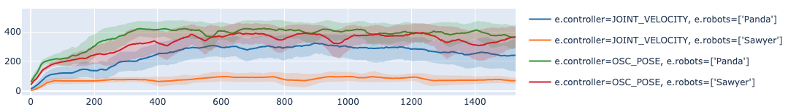
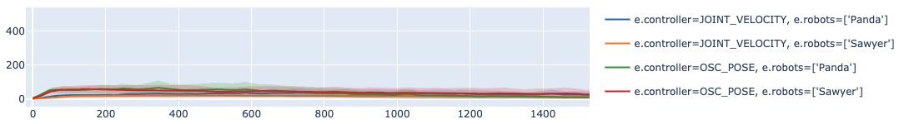
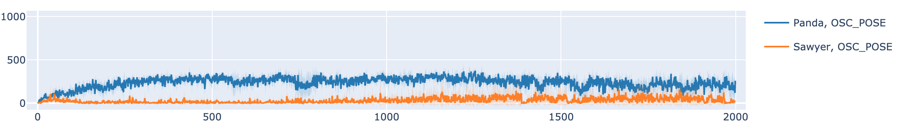
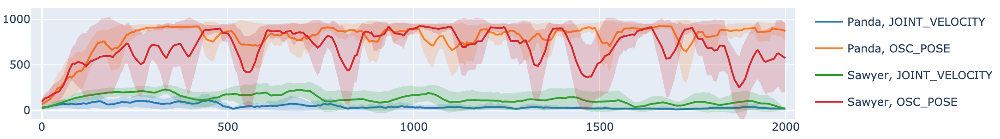
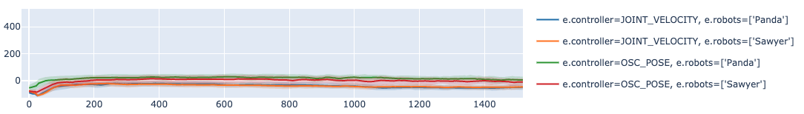
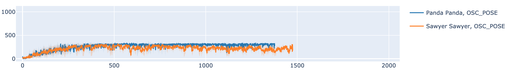
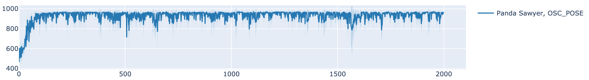
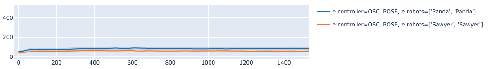

# Benchmarking

Benchmarking results of standard policy learning algorithms.

## v1.0

We provide a standardized set of benchmarking experiments as baselines for future experiments. Specifically, we test [Soft Actor-Critic](https://arxiv.org/abs/1812.05905), a state of the art model-free RL algorithm, on a select combination of tasks (all), robots (Panda, Sawyer), and controllers (OSC_POSE, JOINT_VELOCITY). Our experiments were implemented and executed in an extended version of [rlkit](https://github.com/vitchyr/rlkit), a popular PyTorch-based RL framework and algorithm library. For ease of replicability, we have released our official benchmarking environment which can be found <link here> (see TODO (3)).

All agents were trained for 2000 epochs with 500 steps per episode, and utilize the same algorithm hyperparameters, which can be found <link here> (see TODO (2)). We normalize the rewards such that the maximum possible per-episode return is 1000. Below, we show the per-task experiments conducted, with each experiment's training curve showing the evaluation return mean's average and standard deviation over three random seeds (see TODO (1)).

TODO: (1) Add updated runs with standard hyperparams used for all envs; this will be updated by v1 public release. Currently, beta release only uses 3 runs per task / robot / controller combination.

TODO: (2) Add .json with standard hyperparams used for all envs; currently, per-env/robot/controller hps are used, so this is omitted temporarily for the beta release.

TODO: (3) Add link to benchmarking repo for people to easily replicate runs; this will be prepped and linked by the public release of v1

### Lift
For the Lift task, both OSC_POSE and JOINT_VELOCITY were tested on Panda and Sawyer robots.

### Stack
For the Stack task, both OSC_POSE and JOINT_VELOCITY were tested on Panda and Sawyer robots.

### Pick Place
For the Pick Place task, single-object simplified variations of the task were used. Specifically, PickPlaceCan and PickPlaceMilk were both tested on Panda and Sawyer robots with OSC_POSE.

PickPlaceCan

PickPlaceMilk

### Nut Assembly
For the Nut Assembly task, a single-object simplified variation of the task were used. Specifically, NutAssemblyRound was tested on Panda and Sawyer robots with OSC_POSE.

### Door
For the Door task, both OSC_POSE and JOINT_VELOCITY were tested on Panda and Sawyer robots.

### Wipe
For the Wipe task, both OSC_POSE and JOINT_VELOCITY were tested on Panda and Sawyer robots.

### Two Arm Lift
For the Two Arm Lift task, OSC_POSE was tested on a Panda-Panda pair and Sawyer-Sawyer pair of robots.

### Two Arm Peg in Hole
For the Two Arm Peg in Hole task, OSC_POSE was tested on a Panda-Sawyer pair.

### Two Arm Handover
For the Two Arm Handover task, OSC_POSE was tested on a Panda-Panda pair and Sawyer-Sawyer pair of robots.

## v0.3

- Please see the [Surreal](http://svl.stanford.edu/assets/papers/fan2018corl.pdf) paper for benchmarking results. Code to reproduce results available [here](https://github.com/SurrealAI/surreal).
- For imitation learning results on [RoboTurk](https://roboturk.stanford.edu/) datasets please see the original [RoboTurk](https://arxiv.org/abs/1811.02790) paper and also the [IRIS](https://arxiv.org/abs/1911.05321) paper.