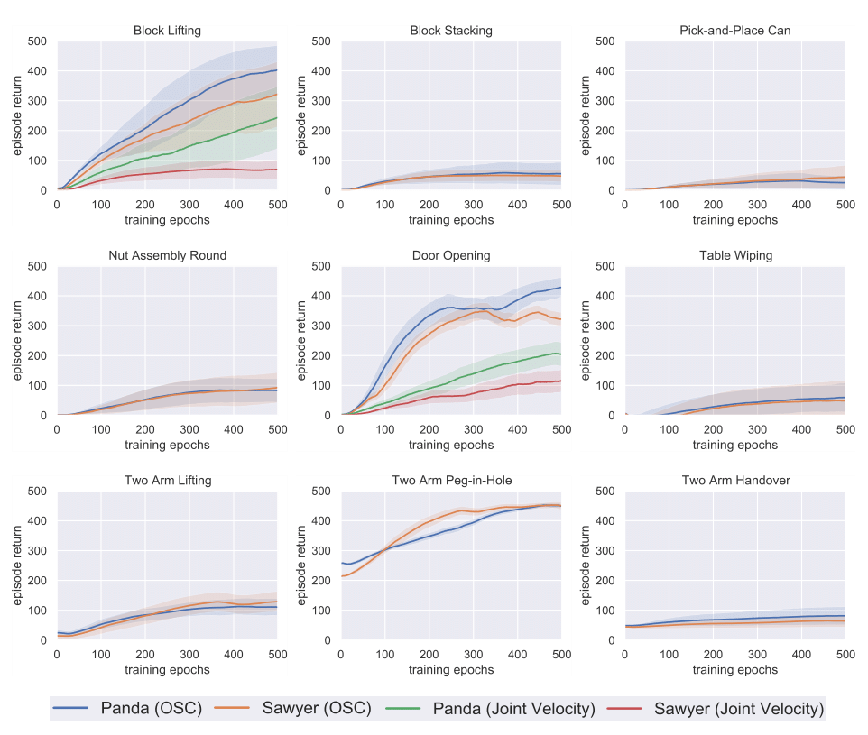

# Benchmarking

Benchmarking results of standard policy learning algorithms.

## v1.0

We provide a standardized set of benchmarking experiments as baselines for future experiments. Specifically, we test [Soft Actor-Critic](https://arxiv.org/abs/1812.05905), a state of the art model-free RL algorithm, on a select combination of tasks (all) using a combination of proprioceptive and object-specific observations, robots (`Panda`, `Sawyer`), and controllers (`OSC_POSE`, `JOINT_VELOCITY`). Our experiments were implemented and executed in an extended version of [rlkit](https://github.com/vitchyr/rlkit), a popular PyTorch-based RL framework and algorithm library. For ease of replicability, we have released our official benchmarking results on a [benchmark repository](https://github.com/ARISE-Initiative/robosuite-benchmark).

All agents were trained for 500 epochs with 500 steps per episode, and utilize the same standardized algorithm hyperparameters (see our benchmarking repo above for exact parameter values). The agents receive the low-dimensional physical states as input to the policy. These experiments ran on 2 CPUs and 12G VRAM and no GPU, each taking about two days to complete. We normalize the per-step rewards to 1.0 such that the maximum possible per-episode return is 500. Above, we show the per-task experiments conducted, with each experiment's training curve showing the evaluation return mean's average and standard deviation over five random seeds. 

We select two of the easiest environments, **Block Lifting** and **Door Opening**, for an ablation study between the operational space controllers (`OSC_POSE`) and the joint velocity controllers (`JOINT_VELOCITY`). We observe that the choice of controllers alone has an evident impact on the efficiency of learning. Both robots learn to solve the tasks faster with the operational space controllers, which we hypothesize is credited to the accelerated exploration in task space; this highlights the potential of this impedance-based controller to improve task performance on robotic tasks that were previously limited by their action space parameterization. The SAC algorithm is able to solve three of the nine environments, including **Block Lifting**, **Door Opening**, and **Two Arm Peg-In-Hole**, while making slow progress in the other environments, which requires intelligent exploration in longer task horizons. For future experiments, we recommend using the nine environments with the Panda robot and the operational space controller, i.e., the blue curves of Panda (OSC) in our benchmarking figure above, for standardized and fair comparisons.

## v0.3

- Please see the [Surreal](http://svl.stanford.edu/assets/papers/fan2018corl.pdf) paper for benchmarking results. Code to reproduce results available [here](https://github.com/SurrealAI/surreal).
- For imitation learning results on [RoboTurk](https://roboturk.stanford.edu/) datasets please see the original [RoboTurk](https://arxiv.org/abs/1811.02790) paper and also the [IRIS](https://arxiv.org/abs/1911.05321) paper.