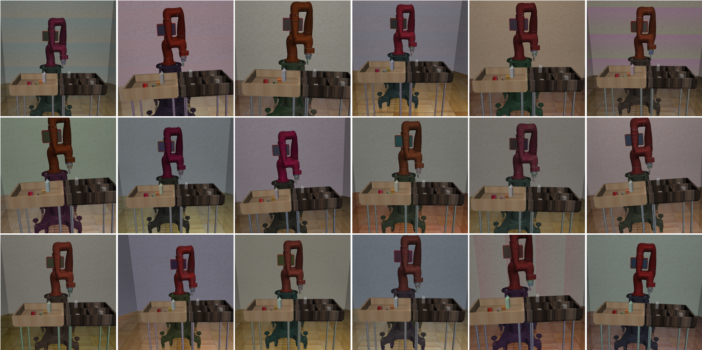
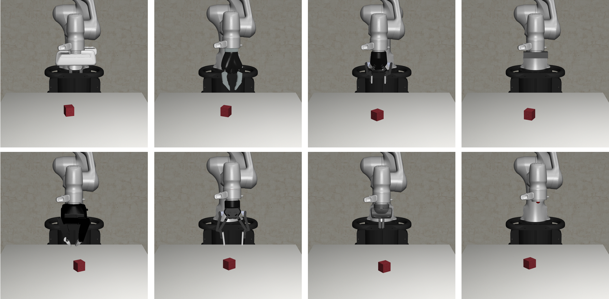

# Demo Showcases

We provide a collection of [demo scripts](https://github.com/ARISE-Initiative/robosuite/tree/master/robosuite/demos) to showcase the functionalities in **robosuite**.

<div class="admonition warning">
<p class="admonition-title">Attention Mac users!</p>

For these scripts, Mac users who wish to use the default mjviewer renderer need to prepend the "python" command with "mj": `mjpython ...`
</div>

### Environment Configuration
The `demo_random_action.py` script is the starter demo script that you should try first. It highlights the modular design of our simulated environments. It enables users to create new simulation instances by choosing one [environment](modules/environments), one or more [robots](modules/robots), and their [controllers](modules/controllers) from the command line. The script creates an environment instance and controls the robots with uniform random actions drawn from the controller-specific action space. The list of all environments, robots, controllers, and gripper types supported in the current version of **robosuite** are defined by `suite.ALL_ENVIRONMENTS`, `suite.ALL_ROBOTS`, `suite. ALL_PART_CONTROLLERS`, and `suite.ALL_GRIPPERS` respectively.


### Controller Test
The `demo_control.py` script demonstrates the various functionalities of each controller available within **robosuite**.
For a given controller, runs through each dimension and executes a perturbation `test_value` from its
neutral (stationary) value for a certain amount of time "steps_per_action", and then returns to all neutral values
for time `steps_per_rest` before proceeding with the next action dim.
For example, given that the expected action space of the `OSC_POSE` controller (without a gripper) is `(dx, dy, dz, droll, dpitch, dyaw)`, the testing sequence of actions over time will be:

```
***START OF DEMO***
( dx,  0,  0,  0,  0,  0, grip)     <-- Translation in x-direction      for 'steps_per_action' steps
(  0,  0,  0,  0,  0,  0, grip)     <-- No movement (pause)             for 'steps_per_rest' steps
(  0, dy,  0,  0,  0,  0, grip)     <-- Translation in y-direction      for 'steps_per_action' steps
(  0,  0,  0,  0,  0,  0, grip)     <-- No movement (pause)             for 'steps_per_rest' steps
(  0,  0, dz,  0,  0,  0, grip)     <-- Translation in z-direction      for 'steps_per_action' steps
(  0,  0,  0,  0,  0,  0, grip)     <-- No movement (pause)             for 'steps_per_rest' steps
(  0,  0,  0, dr,  0,  0, grip)     <-- Rotation in roll (x) axis       for 'steps_per_action' steps
(  0,  0,  0,  0,  0,  0, grip)     <-- No movement (pause)             for 'steps_per_rest' steps
(  0,  0,  0,  0, dp,  0, grip)     <-- Rotation in pitch (y) axis      for 'steps_per_action' steps
(  0,  0,  0,  0,  0,  0, grip)     <-- No movement (pause)             for 'steps_per_rest' steps
(  0,  0,  0,  0,  0, dy, grip)     <-- Rotation in yaw (z) axis        for 'steps_per_action' steps
(  0,  0,  0,  0,  0,  0, grip)     <-- No movement (pause)             for 'steps_per_rest' steps
***END OF DEMO***
```

Thus the `OSC_POSE` controller should be expected to sequentially move linearly in the x direction first, then the y direction, then the z direction, and then begin sequentially rotating about its x-axis, then y-axis, then z-axis. Please reference the documentation of [Controllers](modules/controllers) for an overview of each controller. Controllers are expected to behave in a generally controlled manner, according to their control space. The expected sequential qualitative behavior during the test is described below for each controller:

* `OSC_POSE`: Gripper moves sequentially and linearly in x, y, z direction, then sequentially rotates in x-axis, y-axis, z-axis, relative to the global coordinate frame
* `OSC_POSITION`: Gripper moves sequentially and linearly in x, y, z direction, relative to the global coordinate frame
* `IK_POSE`: Gripper moves sequentially and linearly in x, y, z direction, then sequentially rotates in x-axis, y-axis, z-axis, relative to the local robot end effector frame
* `JOINT_POSITION`: Robot Joints move sequentially in a controlled fashion
* `JOINT_VELOCITY`: Robot Joints move sequentially in a controlled fashion
* `JOINT_TORQUE`: Unlike other controllers, joint torque controller is expected to act rather lethargic, as the "controller" is really just a wrapper for direct torque control of the mujoco actuators. Therefore, a "neutral" value of 0 torque will not guarantee a stable robot when it has non-zero velocity!


### Domain Randomization

The `demo_domain_randomization.py` script showcases our domain randomization functionality. Domain randomization can be easily enabled by wrapping an environment with the [DomainRandomizationWrapper](source/robosuite.wrappers). At this moment, the randomization functionality focuses on visual variations, including colors, textures, and camera viewpoints.




### Sensor Realism
The `demo_sensor_corruption.py` script shows how the [Observable](modules/sensors) functionality can be used to model sensor corruption and delay. The [Observable](modules/sensors) class provides easy-to-use interface for simulating real-world sensor noises, variable sensor delays, and sampling frequencies of realistic sensors. These techniques are useful for improving the generalization and robustness of the policies trained on robosuite, facilitating sim2real transfer to the real hardware. For example, see Appendix B of [Zhu et al. RSS'2018](https://arxiv.org/abs/1802.09564) and Section V of [Tan et al. RSS'2018](https://arxiv.org/abs/1804.10332).


### Gripper Selection
The `demo_gripper_selection.py` script shows you how to select gripper for an environment. This is controlled by `gripper_type` keyword argument. The set of all grippers is defined by the global variable `robosuite.ALL_GRIPPERS`.



### Gripper Interaction & Procedural Generation
The `demo_gripper_interaction.py` script illustrates the process of importing grippers into a scene and making it interact
with the objects with actuators. It also shows how to procedurally generate a scene with the Modeling APIs of the MJCF utility functions.


### Trajectory Replay
The `demo_collect_and_playback_data.py` shows how to record robot roll-out trajectory data with the [DataCollectionWrapper](source/robosuite.wrappers) wrapper and play them back. This wrapper records and stores the environment states in a trajectory to temporary files in `.npz` format (default path: `/tmp`). During playback, it loads the stored states from disk and resets the simulator to these states. Example:
```
$ python demo_collect_and_playback_data.py --environment Door
```

### OpenAI Gym-style APIs
This `demo_gym_functionality.py` script shows how to adapt an environment to be compatible with the [OpenAI Gym](https://gym.openai.com/)-style APIs. This is useful when using learning pipelines that require supporting these APIs. For instance, this can be used with [OpenAI Baselines](https://github.com/openai/baselines) to train agents with RL. We base this script off of some code snippets found in the [Getting Started with Gym](https://gym.openai.com/docs/) section of the OpenAI gym documentation. The following snippet was used to demo basic functionality in OpenAI Gym.

```python
import gym
env = gym.make('CartPole-v0')
for i_episode in range(20):
    observation = env.reset()
    for t in range(100):
        env.render()
        print(observation)
        action = env.action_space.sample()
        observation, reward, done, info = env.step(action)
        if done:
            print("Episode finished after {} timesteps".format(t+1))
            break
```

To adapt the **robosuite** APIs to be compatible with OpenAI Gym's style, this script demonstrates how this can be easily achieved by using the [GymWrapper](source/robosuite.wrappers).


### Teleoperation
The `demo_device_control.py` scripts shows how to teleoperate robot with [control devices](modules/devices), such as keyboard or SpaceMouse. The user input device can be set by the `--device` argument, with the following two options:

* **Keyboard**
    We use the keyboard to control the end-effector of the robot.
    The keyboard provides 6-DoF control commands through various keyboard keys.

    **Note:**
        To run this script with macOS, you must run it with root access.

* **SpaceMouse**
    We use the SpaceMouse 3D mouse from [3Dconnexion](https://www.3dconnexion.com/spacemouse_wireless/en/) to control the end-effector of the robot. The mouse provides 6-DoF control commands.

    We used the SpaceMouse Wireless. The paper below used the same device
    to collect human demonstrations for imitation learning.

    ```text
    Reinforcement and Imitation Learning for Diverse Visuomotor Skills
    Yuke Zhu, Ziyu Wang, Josh Merel, Andrei Rusu, Tom Erez, Serkan Cabi, Saran Tunyasuvunakool,
    János Kramár, Raia Hadsell, Nando de Freitas, Nicolas Heess
    RSS 2018
    ```

    **Note:**
        This current implementation only supports macOS (Linux support can be added).
        Download and install the [driver](https://www.3dconnexion.com/service/drivers.html) before running the script.

* **Mujoco GUI**
        The Mujoco GUI provides a graphical user interface for viewing and interacting with a mujoco simulation. We use the GUI and a mouse to drag and drop mocap bodies, whose
        poses are tracked by a controller. More specifically, once the mujoco GUI is loaded from running `python demo_device_control.py`, you first need to hit the <Tab> key to reach the interactive mujoco viewer state. Then, you should double click on
        a mocap body. Finally, to drag the mocap body, you can hit to <Ctrl> or <Shift> key to translate or rotate the mocap body. For Mac users, you need to use `mjpython demo_device_control.py`. See the note from [mujoco](https://mujoco.readthedocs.io/en/stable/python.html#passive-viewer) for more details.


Additionally, `--pos_sensitivity` and `--rot_sensitivity` provide relative gains for increasing / decreasing the user input
device sensitivity.


Furthermore, please choose environment specifics with the following arguments:

* `--environment`: Task to perform, e.g., `Lift`, `TwoArmPegInHole`, `NutAssembly`, etc.

* `--robots`: Robot(s) with which to perform the task, e.g., `Tiago`, `Panda`, `GR1`, `Sawyer`, etc. Note that the environments include sanity checks, such that a `TwoArm...` environment will not accept configurations with a single, one-armed robot.

* `--config`: Exclusively applicable and only should be specified for `TwoArm...` environments. Specifies the robot
        configuration desired for the task when two robots are inputted. Options are {`parallel` and `opposed`}

    * `parallel`: Sets up the environment such that two robots are stationed next to
                each other facing the same direction. Expects a 2-tuple of robot names to be specified
                in the `--robots` argument.

    * `opposed`: Sets up the environment such that two robots are stationed opposed from
                each other, facing each other from opposite directions. Expects a 2-tuple of robot names
                to be specified in the `--robots` argument.


Examples:
* For normal single-arm environment:
```
$ python demo_device_control.py --environment PickPlaceCan --robots Sawyer
```
* For two-arm bimanual environment:
```
$ python demo_device_control.py --environment TwoArmLift --robots Tiago
```
* For two-arm multi single-arm robot environment:
```
$ python demo_device_control.py --environment TwoArmLift --robots Sawyer Sawyer --config parallel
```

### Video Recording
The `demo_video_recording.py` script shows how to record a video of robot roll-out with the `imageio` library. This script uses offscreen rendering. This is useful for generating qualitative videos of robot policy behaviors. The generated video is in the mp4 format. Example:
```sh
$ python demo_video_recording.py --environment Lift --robots Panda
```

### Rendering Options
The `demo_renderers.py` script shows how to use different renderers with the simulation environments. Our current version supports the default MuJoCo renderer. More information about these renderers can be found in the [Renderer](modules/renderers) module. Example:
```sh
$ python demo_renderers.py --renderer default
```
The `--renderer` flag can be set to `mujoco` or `default(default)

### Exporting to USD
Exporting to USD allows users to render **robosuite** trajectories in external renderers such as NVIDIA Omniverse and Blender. In order to export to USD you must install the required dependencies for the exporter.
```sh
$ pip install usd-core pillow tqdm
```
Once the dependencies are installed, the USD exporter can be imported via `from robosuite.utils.usd import exporter`. The `USDExporter` class in the `exporter` module handles exporting all nessecary assets and USD files associated with a **robosuite** trajectory. 

First, instantiate a **robosuite** environment. Each environment has an MjModel and MjData instance associated with it. These attributes can be retrieved using
```python
model = env.sim.model._model
data = env.sim.data._data
```
Both `model` and `data` are used by the USD exporter. Once a robosuite environment is defined, create a `USDExporter` object with the following arguments.

* `model` (required): an MjModel instance.
* `max_geom`: Optional integer specifying the maximum number of geoms that
can be rendered in the same scene. If None this will be chosen
automatically based on the estimated maximum number of renderable
geoms in the model.
* `output_directory_name`: name of root directory to store outputted frames
and assets generated by the USD renderer.
and assets by the USD renderer.
* `light_intensity`: default intensity of the lights in the external renderer.
* `shareable`: use relative paths to assets instead of absolute paths to allow
files to be shared across users.
* `online`: set to true if using USD exporter for online rendering. This value
is set to true when rendering with Isaac Sim. If online is set to true, shareable must be false.
* `framerate`: framerate of the exported scene when rendered
* `camera_names`: list of fixed cameras defined in the mujoco model to render.
* `stage`: predefined stage to add objects in the scene to.
* `verbose`: decides whether to print updates.

`USDExporter` is adapted from [MuJoCo](https://github.com/google-deepmind/mujoco). In order to add a new frame in the outputted USD trajectory, call `update_scene` in the `exporter` module. 

```python
exp = exporter.USDExporter(model=model, output_directory_name="usd_demo")
exp.update_scene(data)
```

This updates all geoms in the scene with their current poses from simulation. To save a USD trajectory, use the `save_scene` method.

```python
exp.save_scene(filetype="usd")
```

Users are able to save scenes as .usd, .usda, or .usdc files. For a more comprehensive example of the USD renderer, please refer to the [`demo_usd_export.py`]() script. This demonstration allows users to teleoperate a robot with a device (i.e. keyboard or spacemouse) and save the collected trajectory as a USD file. 
