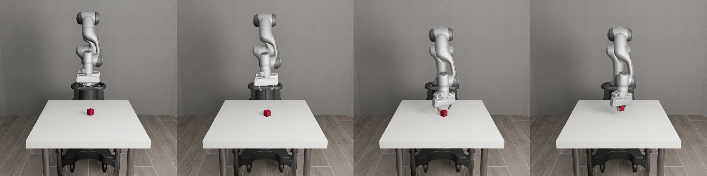
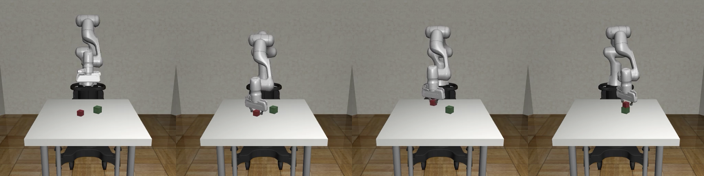
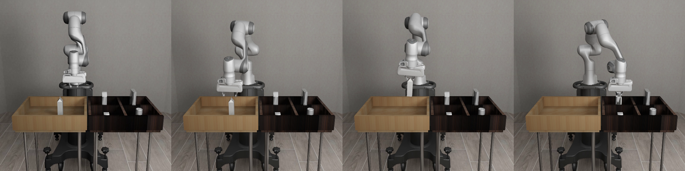
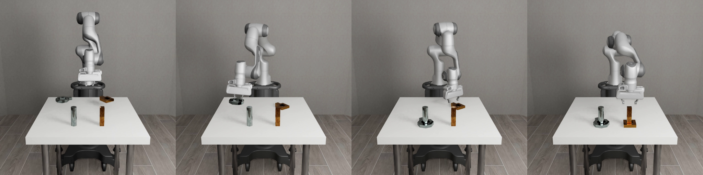
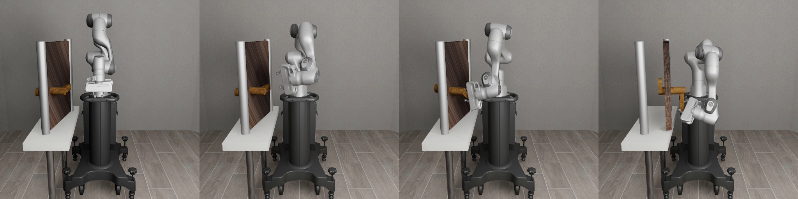
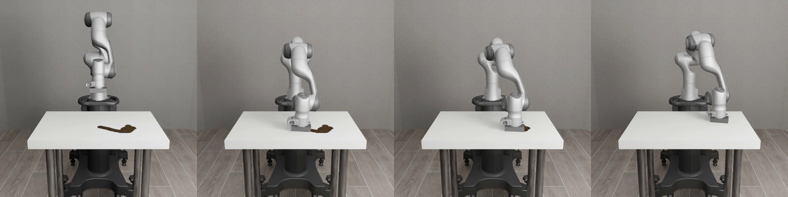
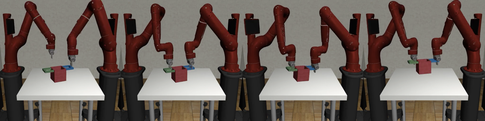
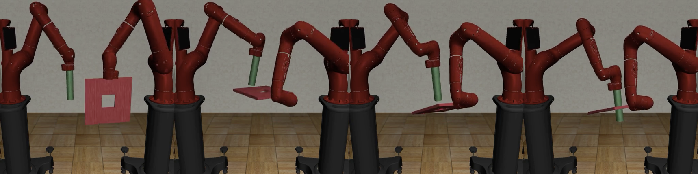
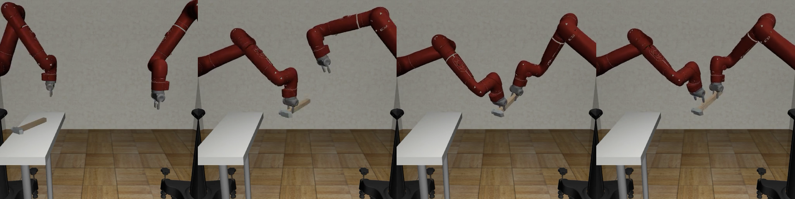

# Environments

Environments are the main **robosuite** API objects that external code will interact with. Each environment corresponds to a robot manipulation task and provides a standard interface for an agent to interact with the environment. While **robosuite** can support environments from different robotic domains, the current release focuses is on manipulation environments.

Next, we will describe how to create an environment, how to interact with an environment, and how each environment creates a simulated task in the MuJoCo physics engine. We will use the `TwoArmLift` environment as a running example for each section.

## Making an Environment

Environments are created by calling `robosuite.make` with the name of the task and with a set of arguments that configure environment properties. We provide a few examples of different use cases below.

```python
import robosuite
from robosuite.controllers import load_composite_controller_config

# BASIC controller: arms controlled using OSC, mobile base (if present) using JOINT_VELOCITY, other parts controlled using JOINT_POSITION 
controller_config = load_composite_controller_config(controller="BASIC")

# create an environment to visualize on-screen
env = robosuite.make(
    "TwoArmLift",
    robots=["Sawyer", "Panda"],             # load a Sawyer robot and a Panda robot
    gripper_types="default",                # use default grippers per robot arm
    controller_configs=controller_config,   # arms controlled via OSC, other parts via JOINT_POSITION/JOINT_VELOCITY
    env_configuration="opposed",            # (two-arm envs only) arms face each other
    has_renderer=True,                      # on-screen rendering
    render_camera="frontview",              # visualize the "frontview" camera
    has_offscreen_renderer=False,           # no off-screen rendering
    control_freq=20,                        # 20 hz control for applied actions
    horizon=200,                            # each episode terminates after 200 steps
    use_object_obs=False,                   # no observations needed
    use_camera_obs=False,                   # no observations needed
)

# create an environment for policy learning from low-dimensional observations
env = robosuite.make(
    "TwoArmLift",
    robots=["Sawyer", "Panda"],             # load a Sawyer robot and a Panda robot
    gripper_types="default",                # use default grippers per robot arm
    controller_configs=controller_config,   # arms controlled via OSC, other parts via JOINT_POSITION/JOINT_VELOCITY
    env_configuration="opposed",            # (two-arm envs only) arms face each other
    has_renderer=False,                     # no on-screen rendering
    has_offscreen_renderer=False,           # no off-screen rendering
    control_freq=20,                        # 20 hz control for applied actions
    horizon=200,                            # each episode terminates after 200 steps
    use_object_obs=True,                    # provide object observations to agent
    use_camera_obs=False,                   # don't provide image observations to agent
    reward_shaping=True,                    # use a dense reward signal for learning
)

# create an environment for policy learning from pixels
env = robosuite.make(
    "TwoArmLift",
    robots=["Sawyer", "Panda"],             # load a Sawyer robot and a Panda robot
    gripper_types="default",                # use default grippers per robot arm
    controller_configs=controller_config,   # arms controlled via OSC, other parts via JOINT_POSITION/JOINT_VELOCITY
    env_configuration="opposed",            # (two-arm envs only) arms face each other
    has_renderer=False,                     # no on-screen rendering
    has_offscreen_renderer=True,            # off-screen rendering needed for image obs
    control_freq=20,                        # 20 hz control for applied actions
    horizon=200,                            # each episode terminates after 200 steps
    use_object_obs=False,                   # don't provide object observations to agent
    use_camera_obs=True,                   # provide image observations to agent
    camera_names="agentview",               # use "agentview" camera for observations
    camera_heights=84,                      # image height
    camera_widths=84,                       # image width
    reward_shaping=True,                    # use a dense reward signal for learning
)
```

### Modular Design

We provide a few additional details on a few keyword arguments below to highlight the modular structure of creating **robosuite** environments, and how easy it is to configure different environment features.

- `robots` : this argument can be used to easily instantiate tasks with different robot arms. For example, we could change the task to use two "Jaco" robots by passing `robots=["Jaco", "Jaco"]`. Once the environment is initialized, these robots (as captured by the [Robot](../simulation/robot.html#robot) class) can be accessed via the `robots` array attribute within the environment, i.e.: `env.robots[i]` for the `ith` robot arm in the environment.
- `gripper_types` : this argument can be used to easily swap out different grippers for each robot arm. For example, suppose we want to swap the default grippers for the arms in the example above. We could just pass `gripper_types=["PandaGripper", "RethinkGripper"]` to achieve this. Note that a single type can also be used to automatically broadcast the same gripper type across all arms.
- `controller_configs` : this argument can be used to easily replace the action space for each robot. For example, if we would like to control the robot using IK instead of OSC, we could use `load_composite_controller_config(controller="WHOLE_BODY_IK")` in the example above. 
- `env_configuration` : this argument is mainly used for two-arm tasks to easily configure how the robots are oriented with respect to one another. For example, in the `TwoArmLift` environment, we could pass `env_configuration="parallel"` instead so that the robot arms are located next to each other, instead of opposite each other
- `placement_initializer` : this argument is optional, but can be used to specify a custom `ObjectPositionSampler` to override the default start state distribution for Mujoco objects. Samplers are responsible for sampling a set of valid, non-colliding placements for all of the objects in the scene at the start of each episode (e.g. when `env.reset()` is called).

## Interacting with an Environment

### Policy Loop

```python
# this example assumes an env has already been created, and performs one agent rollout
import numpy as np

def get_policy_action(obs):
    # a trained policy could be used here, but we choose a random action
    low, high = env.action_spec
    return np.random.uniform(low, high)

# reset the environment to prepare for a rollout
obs = env.reset()

done = False
ret = 0.
while not done:
    action = get_policy_action(obs)         # use observation to decide on an action
    obs, reward, done, _ = env.step(action) # play action
    ret += reward
print("rollout completed with return {}".format(ret))
```

### Observations

**robosuite** observations are dictionaries that include key-value pairs per modality. This makes it easy for agents to work with modalities of different shapes (for example, flat proprioception observations, and pixel observations). Note that any observation entry ending with `*-state` represents a concatenation of all individual observations that belong to `*` modality. Below, we list commonly used observation keys.

- `robot0_proprio-state`, `robot1_proprio-state` : proprioception observations for each robot arm. This includes the arm joint positions (encoded using `sin` and `cos`), arm joint velocities, end effector pose, gripper finger positions, and gripper finger velocities. The shape for this modality is flat (e.g. `(N,)`).
- `object-state` : task-specific object observations. For example, the `TwoArmLift` environment provides the pose of the pot, the position of each handle, and the relative position of each robot gripper with respect to each handle. The shape for this modality is flat (e.g. `(N,)`).
- `{camera_name}_image` : image observations for camera with name `camera_name`. The shape for this modality is `(H, W, 3)` where `H` and `W` are the height and width of the image respectively. By default, the returned image convention is mujoco's native `opengl` ("flipped"). This can alternatively be set to `opencv` convention (unflipped) via the `IMAGE_CONVENTION` macro in `macros.py`.
- `{camera_name}_depth` : depth image observations for camera with name `camera_name`. The shape for this modality is `(H, W)` where `H` and `W` are the height and width of the image respectively. By default, the returned image convention is mujoco's native `opengl` ("flipped"). This can alternatively be set to `opencv` convention (unflipped) via the `IMAGE_CONVENTION` macro in `macros.py`.
- `image-state` : (optional) stacked image observations. Note that this is disabled by default, and can be toggled via the `CONCATENATE_IMAGES` macro in `macros.py`.

### Rewards and Termination

Each environment implements a reward function in the `reward` method of each environment class. The reward can be either be a binary success or failure reward (nonzero if the current state is a task completion state) or a dense, shaped reward that is crafted to be (mostly) non-negative and non-decreasing along trajectories that solve the task. The reward function that is used is determined by the `reward_shaping` argument. The binary success check that is used to compute the sparse reward is implemented in the  `_check_success` method of each environment class.

Importantly, **robosuite** environments do not terminate if a success criterion is reached, but always continue for a fixed number of timesteps, determined by the `horizon` argument. This is a standard design decision for reinforcement learning in robot manipulation domains.

We provide an example via the reward function and success criteria for `TwoArmLift` below.  Note that for simplicity, we provide function aliases instead of actual implementation details so that the logic remains easy to follow:

For the success criteria, we simply want to check if the pot is successfully lifted above a certain height threshold over the table, and return `True` or `False` accordingly.

```python
def _check_success(self):
    pot_height = get_pot_height()
    table_height = get_table_height()
    return pot_height > table_height + 0.10
```

The reward function is a bit more involved. First, we initialize our reward variable to 0 and grab relevant sensory data from the environment, checking to see if the pot is tilted or not.
```python
def reward(self, action=None):
    reward = 0
    pot_tilt = get_pot_tilt()

    # check if the pot is tilted more than 30 degrees
    cos_30 = np.cos(np.pi / 6)
    direction_coef = 1 if pot_tilt >= cos_30 else 0
```

Next, we first check to see if we have completed the task (the pot being lifted above the table and not overly tilted), and if so, apply the un-normalized reward.
```python
    if self._check_success():
    reward = 3.0 * direction_coef
```

Otherwise, we'll only provide partial rewards if we're using reward shaping, and calculate the appropriate reward.
```python
    elif self.reward_shaping:
        
        # lifting reward (smooth value between [0, 1.5])
        pot_height = get_pot_height()
        r_lift = min(max(pot_height - 0.05, 0), 0.15)
        reward += 10. * direction_coef * r_lift
        
        # reaching reward (smooth value between [0, 1])
        left_hand_handle_distance = get_left_distance()
        right_hand_handle_distance = get_right_distance()
        reward += 0.5 * (1 - np.tanh(10.0 * left_hand_handle_distance))
        reward += 0.5 * (1 - np.tanh(10.0 * right_hand_handle_distance))
        
        # grasping reward (discrete values between [0, 0.5])
        left_hand_handle_contact = is_left_contact()
        right_hand_handle_contact = is_right_contact()
        if left_hand_handle_contact:
            reward += 0.25
        if right_hand_handle_contact:
            reward += 0.5
```

Lastly, we need to normalize our reward and then re-scale its value to `reward_scale` if it is specified before finally returning the calculated reward.
```python
    if self.reward_scale is not None:
        reward *= self.reward_scale / 3.0
        
    return reward
```

## Task Models

Every environment owns its own `MJCF` model that sets up the MuJoCo physics simulation by loading the robots, the workspace, and the objects into the simulator appropriately. This MuJoCo simulation model is programmatically instantiated in the `_load_model` function of each environment, by creating an instance of the `Task` class.

Each `Task` class instance owns an `Arena` model, a list of `RobotModel` instances, and a list of `ObjectModel` instances. These are **robosuite** classes that introduce a useful abstraction in order to make designing scenes in MuJoCo easy. Every `Arena` is based off of an xml that defines the workspace (for example, table or bins) and camera locations. Every `RobotModel` is a MuJoCo model of representing an arbitrary robot (for `ManipulationModel`s, this represent armed robots, e.g. Sawyer, Panda, etc.). Every `ObjectModel` corresponds to a physical object loaded into the simulation (e.g. cube, pot with handles, etc.).

## Task Descriptions

While **robosuite** can support environments from different robotic domains, the current release focuses is on manipulation environments (`ManipulationEnv`), We provide a brief description of each environment below. For benchmarking results on these standardized environments, please check out the [Benchmarking](../algorithms/benchmarking) page.

### Single-Arm Tasks

#### Block Lifting



- **Scene Description**: A cube is placed on the tabletop in front of a single robot arm.
- **Goal**: The robot arm must lift the cube above a certain height.
- **Start State Distribution**: The cube location is randomized at the beginning of each episode.

#### Block Stacking



- **Scene Description**: Two cubes are placed on the tabletop in front of a single robot arm.
- **Goal**: The robot must place one cube on top of the other cube. 
- **Start State Distribution**: The cube locations are randomized at the beginning of each episode.

#### Pick-and-Place



- **Scene Description**: Four objects are placed in a bin in front of a single robot arm. There are four containers next to the bin.
- **Goal**: The robot must place each object into its corresponding container. This task also has easier single-object variants.
- **Start State Distribution**: The object locations are randomized at the beginning of each episode.

#### Nut Assembly



- **Scene Description**: Two colored pegs (one square and one round) are mounted on the tabletop, and two colored nuts (one square and one round) are placed on the table in front of a single robot arm.
- **Goal**: The robot must fit the square nut onto the square peg and the round nut onto the round peg. This task also has easier single nut-and-peg variants.
- **Start State Distribution**: The nut locations are randomized at the beginning of each episode.

#### Door Opening



- **Scene Description**: A door with a handle is mounted in free space in front of a single robot arm.
- **Goal**: The robot arm must learn to turn the handle and open the door.
- **Start State Distribution**: The door location is randomized at the beginning of each episode.

#### Table Wiping



- **Scene Description**: A table with a whiteboard surface and some markings is placed in front of a single robot arm, which has a whiteboard eraser mounted on its hand.
- **Goal**: The robot arm must learn to wipe the whiteboard surface and clean all of the markings.
- **Start State Distribution**: The whiteboard markings are randomized at the beginning of each episode.

### Two-Arm Tasks

#### Two Arm Lifting



- **Scene Description**: A large pot with two handles is placed on a table top. Two robot arms are placed on the same side of the table or on opposite ends of the table.
- **Goal**: The two robot arms must each grab a handle and lift the pot together, above a certain height, while keeping the pot level.
- **Start State Distribution**: The pot location is randomized at the beginning of each episode.

#### Two Arm Peg-In-Hole



- **Scene Description**: Two robot arms are placed either next to each other or opposite each other. One robot arm holds a board with a square hole in the center, and the other robot arm holds a long peg.
- **Goal**: The two robot arms must coordinate to insert the peg into the hole.
- **Start State Distribution**: The initial arm configurations are randomized at the beginning of each episode.

#### Two Arm Handover



- **Scene Description**: A hammer is placed on a narrow table. Two robot arms are placed on the same side of the table or on opposite ends of the table.
- **Goal**: The two robot arms must coordinate so that the arm closer to the hammer picks it up and hands it to the other arm.
- **Start State Distribution**: The hammer location and size is randomized at the beginning of each episode.
