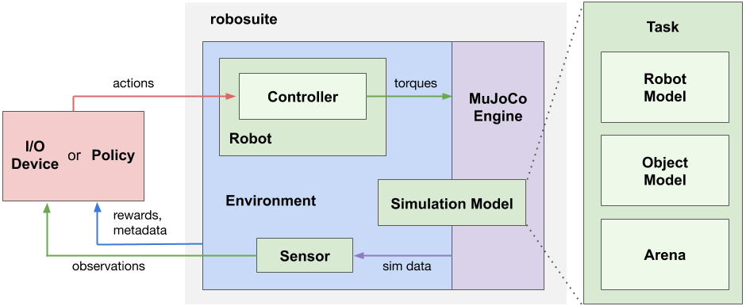

# Overview

Our framework offers two main categories of APIs: 1) **Modeling APIs** for defining simulation environments in a modular and programmatic fashion, and 2) **Simulation APIs** for interfacing with external inputs such as from a **Policy** or an **I/O Device**. A **Simulation Model** specified by the Modeling APIs is instantiated by the **MuJoCo Engine** to create a simulation runtime, called **Environment**. The Environment generates observations through the **Sensors**, such as cameras and proprioception, and receives action commands from policies or devices through the **Controllers** of the **Robots**. The diagram above illustrates the key components in our framework and their relationships.

A simulation model is defined by a [Task](../modeling/task) object, which encapsulates three essential constituents of robotic simulation: [Robot Model](../modeling/robot_model)s, [Object Model](../modeling/object_model)s, and [Arena](../modeling/arena). A task may contain one or more robots, zero to many objects, and a single arena. The Robot Model loads models of robots and optionally other models as well; for example, the [Manipulator](../) robot model class also loads a corresponding [Gripper Model](../modeling/gripper_model)s from XML files. The Object Model can be either loaded from 3D object assets or procedurally generated with programmatic APIs. The Arena defines the workspace of the robot, including the environment fixtures, such as a tabletop, and their placements. The task class combines these constituents into a single XML object in MuJoCo's [MJCF modeling language](http://www.mujoco.org/book/XMLreference.html). This MJCF object is passed to the MuJoCo engine through the [mujoco-py](https://openai.github.io/mujoco-py/build/html/index.html) library to instantiate the [MjSim](https://openai.github.io/mujoco-py/build/html/reference.html#mjsim-basic-simulation) object for simulation runtime.

The [Environment](environments) object provides [OpenAI Gym](https://gym.openai.com/)-style APIs for external inputs to interface with the simulation. External inputs correspond to the action commands used to control the [Robots](robots) and any actuators it owns (for example, in the case of a manipulator robot the arm joints and gripper), where the kinematic component of the action spaces are specific to the [Controllers](controllers) used by the robots. For instance, for joint-space controllers of a robot manipulator arm, the action space corresponds to the number of joints of the robot, and for operational space controllers, the action space corresponds to 3D Cartesian movement or 6D pose of the end-effector. These action commands can either be automatically generated by an algorithm (such as a deep neural network policy) or come from [I/O devices](devices) for human teleoperation (such as the keyboard). The controllers of the robots are responsible for interpreting these action commands and transforming them into the low-level torques passing to the underlying physics engine, which performs internal computations to determine the next state of the simulation. [Sensors](./sensors) retrieve information from the MjSim object and generate observations as the physical signals that the robots receive as response to their actions. Our framework supports multimodal sensing modalities, such as RGB-D cameras, force-torque measurements, and proprioceptive data, and also provides modular APIs to model realistic sensor dynamics. In addition to these sensory data, environments also provide additional information about the task progress and success conditions, including reward functions (for reinforcement learning) and other meta-data. For more information, please check out the descriptions of the individual components in this section.

