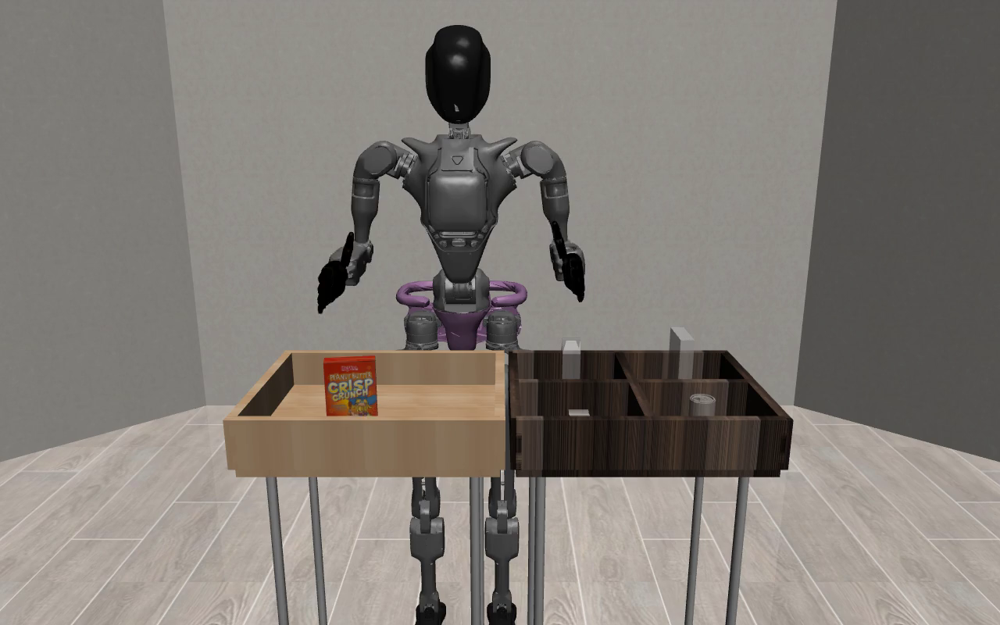
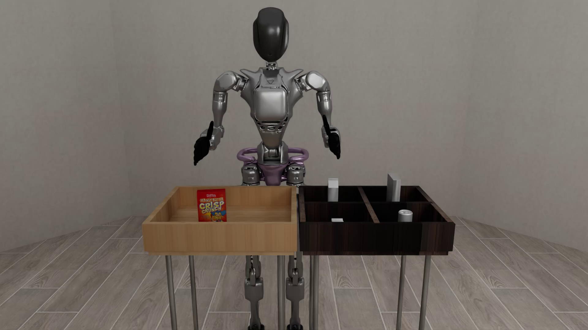

# Renderers

[Renderers](../source/robosuite.renderers) are used to visualize the simulation, and can be used either in on-screen mode or headless (off-screen) mode. Renderers are also responsible for generating image-based observations that are returned from a given environment, and compute virtual images of the environment based on the properties defined in the cameras.

Currently, the following ground-truth vision modalities are supported by the MuJoCo renderer:

- **RGB**: Standard 3-channel color frames with values in range `[0, 255]`. This is set during environment construction with the `use_camera_obs` argument.
- **Depth**: 1-channel frame with normalized values in range `[0, 1]`. This is set during environment construction with the `camera_depths` argument.
- **Segmentation**: 1-channel frames with pixel values corresponding to integer IDs for various objects. Segmentation can
    occur by class, instance, or geom, and is set during environment construction with the `camera_segmentations` argument.

**robosuite** presents the following rendering options:

<!--  -->

## MuJoCo Default Renderer

MuJoCo exposes users to an OpenGL context supported by [mujoco](https://mujoco.readthedocs.io/en/latest/python.html#rendering). Based on [OpenGL](https://www.opengl.org/), our assets and environment definitions have been tuned to look good with this renderer. The rendered frames can be displayed in a window with [OpenCV's imshow](https://pythonexamples.org/python-opencv-imshow/).

## Isaac Rendering

Users are also able to render using photorealistic methods through Isaac Sim. Specifically, we users are able to choose between two rendering modes: ray tracing and path tracing. For more information about Isaac Sim rendering options, please visit [here](https://docs.omniverse.nvidia.com/materials-and-rendering/latest/rtx-renderer.html). Isaac renderers are only available to those who are running on a Linux or Windows machine.

### Ray tracing

Ray tracing can be performed in real time. We are currently working on enhancing the rendering pipeline to support an online viewer with ray tracing capabilities.

### Path tracing

Path tracing typically offers higher quality and is ideal for offline learning. If you have the time to collect data and plan to train algorithms using offline data, we recommend using path tracing for its photorealistic results.

### Rendering Speed

Below, we present a table showing the estimated frames per second when using these renderers. Note that the exact speed of rendering might depend on your machine and scene size. Larger scenes may take longer to render. Additionally, changing renderer inputs such as samples per pixel (spp) or max bounces might affect rendering speeds. The values below are estimates using the `Lift` task with an NVIDIA GeForce RTX 4070 Ti. We use an spp of 64 when rendering with path tracing.

| Renderer       | Estimated FPS |
|----------------|---------------|
| MuJoCo         | 80-90         |
| Ray Tracing    | 40-60         |
| Path Tracing   | 1-2           |
