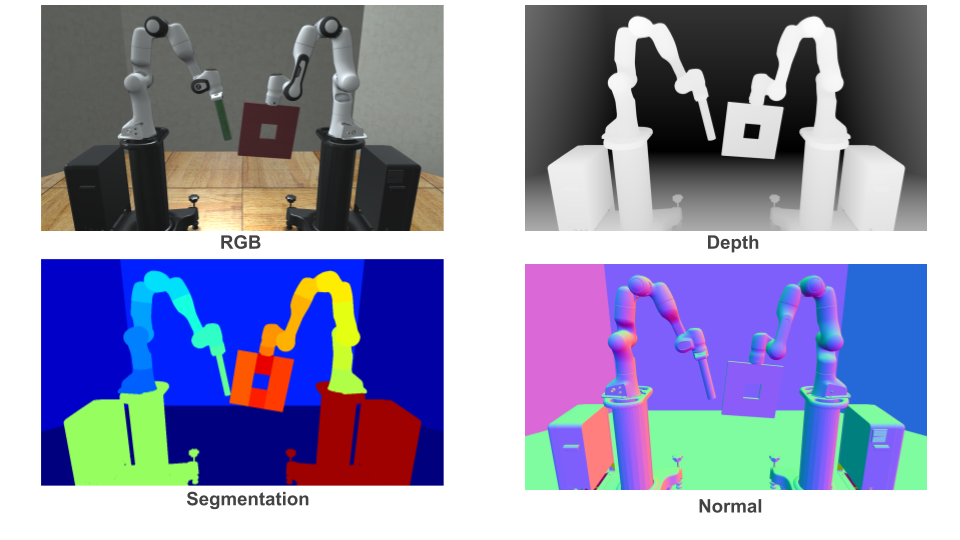

# Renderers

Renderers are used to visualize the simulation, and can be used either in on-screen mode or headless (off-screen) mode. Renderers are also responsible for generating image-based observations that are returned from a given environment, and compute virtual images of the environment based on the properties defined in the cameras.

Currently, the following ground-truth vision modalities are supported across the three renderers, MjViewer, NViSII, and iGibson:

- **RGB**: Standard 3-channel color frames with values in range `[0, 255]`. This is set during environment construction with the `use_camera_obs` argument.
- **Depth**: 1-channel frame with normalized values in range `[0, 1]`. This is set during environment construction with the `camera_depths` argument.
- **Segmentation**: 1-channel frames with pixel values corresponding to integer IDs for various objects. Segmentation can
    occur by class, instance, or geom, and is set during environment construction with the `camera_segmentations` argument.

In **robosuite**, the user has the following options for the renderers:

##### MjViewer / MjRenderContextOffscreen

This is the default onscreen / offscreen renderer from [mujoco-py](https://openai.github.io/mujoco-py/build/html/reference.html#mjviewer-3d-rendering). Based on [OpenGL](https://www.opengl.org/), our assets and environment definitions have been tuned to look good with this renderer.

<!-- ##### iGibson Renderer-->
<!--This renderer is included in the [iGibson simulator](http://svl.stanford.edu/igibson/). We include an initial (not optimized) set of alternative meshes (OBJ files instead of the STL used by MjViewer) to be used with this simulator. The iGibson simulator can be used in simple mode (renders only albedo) or in physics-based rendering (PBR) mode (renders additional properties such as metallic, or roughness).--> 

##### PyGame

[PyGame](https://www.pygame.org/news) is a simple renderer that serves also as an alternative to MjViewer for rendering onscreen. A limitation of PyGame is that it can only render on-screen, limiting its applicability to train on computing clusters. This is because PyGame still relies on the MjRenderContextOffscreen to render frames offscreen, from which PyGame then maps to its native onscreen renderer. However, it is useful for visualizing the robots' behaviors in the system runtime where MjViewer is not supported.

##### NVISII
[NVISII](https://github.com/owl-project/NVISII) is a ray tracing-based renderer. The renderer is primarily used for training perception models and visualizing results in high quality. Through NViSII, we can obtain different vision modalities, including depth, segmentations, surface normals, texture coordinates, and texture positioning.

###### Using the NViSII renderer
Installing NViSII can be done using the command `pip install nvisii`. Note that NViSII requires users' drivers to be up to date. Please refer [here](https://github.com/owl-project/NVISII) for more information.

##### iGibson
[iGibson](http://svl.stanford.edu/igibson/) is a simulation environment featuring fast visual rendering and physics simulation based on Bullet. From various functionalities that iGibson offers, we have integrated its rendererer into the **robosuite** environment. This renderer supports faster rendering and training on a variety of vision modalities like rgb, depth, surface normal, and segmenation. It uses [physically based rendering](https://en.wikipedia.org/wiki/Physically_based_rendering) (PBR), a computer graphics rendering technique that seeks to render images in a way that models the flow of light in the real world. It is also capable of rendering and returning [PyTorch tensors](https://pytorch.org/docs/stable/tensors.html) which reduces the tensor copying time between CPU and GPU during the model training process.

###### Using the iGibson Renderer
Installing iGibson can be done using the command `pip install igibson`. Please refer to the [iGibson installation guide](http://svl.stanford.edu/igibson/docs/installation.html) for a step by step guide.

