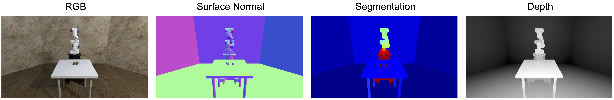

# Renderers

[Renderers](../source/robosuite.renderers) are used to visualize the simulation, and can be used either in on-screen mode or headless (off-screen) mode. Renderers are also responsible for generating image-based observations that are returned from a given environment, and compute virtual images of the environment based on the properties defined in the cameras.

Currently, the following ground-truth vision modalities are supported across the three renderers, MjViewer, NVISII, and iGibson:

- **RGB**: Standard 3-channel color frames with values in range `[0, 255]`. This is set during environment construction with the `use_camera_obs` argument.
- **Depth**: 1-channel frame with normalized values in range `[0, 1]`. This is set during environment construction with the `camera_depths` argument.
- **Segmentation**: 1-channel frames with pixel values corresponding to integer IDs for various objects. Segmentation can
    occur by class, instance, or geom, and is set during environment construction with the `camera_segmentations` argument.

Additional modalities are supported by a subset of the renderers. In **robosuite**, the user has the following rendering options:

## mujoco-py

MujocoRenderer is the default onscreen (MjViewer) and offscreen (MjRenderContextOffscreen) renderer supported by [mujoco-py](https://openai.github.io/mujoco-py/build/html/reference.html#mjviewer-3d-rendering). Based on [OpenGL](https://www.opengl.org/), our assets and environment definitions have been tuned to look good with this renderer.

## NVISII
NVISIIRenderer is a ray tracing-based renderer. It is primarily used for training perception models and visualizing results in high quality. Through [NVISII](https://github.com/owl-project/NVISII), we can obtain different vision modalities, including depth, segmentations, surface normals, texture coordinates, and texture positioning.

### Using the NVISII renderer
Installing NVISII can be done using the command `pip install nvisii`. Note that NVISII requires users' drivers to be up to date. Please refer [here](https://github.com/owl-project/NVISII) for more information. You can try the NVISII renderer with the `demo_renderers.py` [script](../demos.html#rendering-options) and learn about the APIs for obtaining vision modalities with `demo_nvisii_modalities.py`.

## iGibson
iGibsonRenderer is a [physically based renderer](https://en.wikipedia.org/wiki/Physically_based_rendering) (PBR), a computer graphics rendering technique that seeks to render images in a way that models the flow of light in the real world. The original [iGibson](http://svl.stanford.edu/igibson/) features fast visual rendering and physics simulation based on Bullet. We have created a version of robosuite that uses only the renderer of iGibson. This renderer supports faster rendering and training on a variety of vision modalities like depth, surface normal, and segmentation. It is also capable of rendering and returning [PyTorch tensors](https://pytorch.org/docs/stable/tensors.html), allowing for tensor-to-tensor rendering that reduces the tensor copying time between CPU and GPU accelerating substantially the model training process in RL. 

### Using the iGibson Renderer
Installing iGibson can be done using the command `pip install igibson`. Please refer to the [iGibson installation guide](http://svl.stanford.edu/igibson/docs/installation.html) for a step by step guide. You can try the iGibson renderer with the `demo_renderers.py` [script](../demos.html#rendering-options) and learn about the APIs for obtaining vision modalities with `demo_igibson_modalities.py`.

## PyGame

[PyGame](https://www.pygame.org/news) is a simple renderer that serves also as an alternative to MjViewer for rendering onscreen. A limitation of PyGame is that it can only render on-screen, limiting its applicability to train on computing clusters. This is because PyGame still relies on the MjRenderContextOffscreen to render frames offscreen, from which PyGame then maps to its native onscreen renderer. However, it is useful for visualizing the robots' behaviors in the system runtime where MjViewer is not supported. Check out this [demo script](../demos.html#pygame-renderer) for an example of using the PyGame renderer.

## Renderer Profiling
The following table shows the estimated frame rate of each renderer in frames per second (FPS). The profiling was conducted on a machine with Ubuntu 18.04, Intel Core i9-900K CPU@3.60GHz, and Nvidia RTX. The FPS numbers of each rendering option are reported below. These numbers are estimated on the Door environment with IIWA robot and Joint Velocity controller and 256x256 image size.

|                   | mujoco-py | iGibson (render2tensor optimized) | iGibson (render2tensor) | iGibson (render2numpy) | NVISII |
|-------------------|:---------:|:---------------------------------:|:-----------------------:|:----------------------:|:------:|
| Simulation + rendering | 62 | 64 | 58 | 45 | 0.5 |
| Rendering only         | 508 | 1392 | 285 | 271 | 0.5 |

In practice, both mujoco-py and iGibson renderers are well-suited for vision-based policy learning. In comparison, iGibson offers a faster rendering speed and additional functionalities for perception research. You might also find that iGibson has better cross-platform compatibility than the generic mujoco-py renderer, but it requires iGibson as a dependency. NVISII is best suited for photorealistic rendering; however, the ray-tracing computation substantially slows down its rendering speed compared to the other two renderers. It is mainly intended for perception tasks and qualitative visualizations, rather than online policy training.
