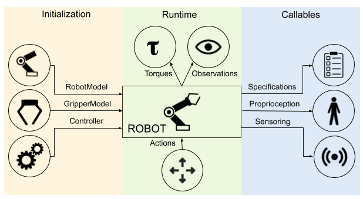
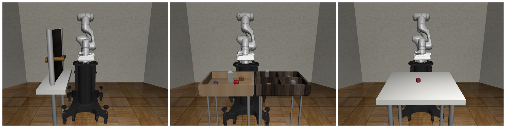
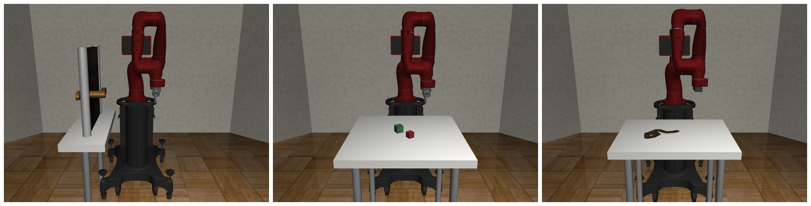
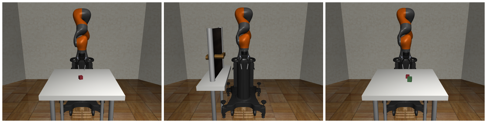
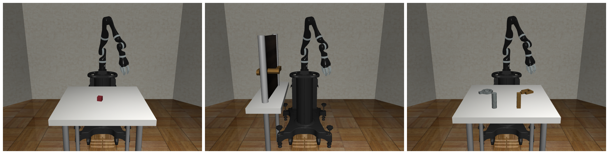
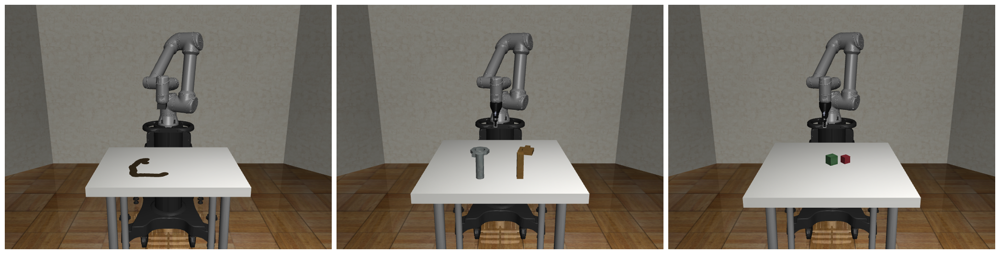
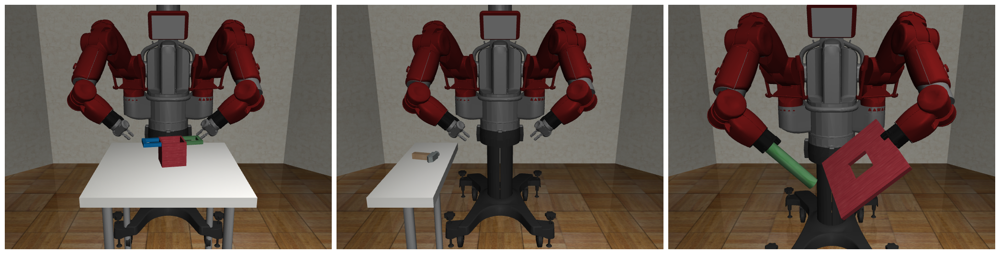

# Robots

**Robots** are a key component in **robosuite**, and serve as the embodiment of a given agent as well as the central interaction point within an environment and key interface to MuJoCo for the robot-related state and control. **robosuite** captures this level of abstraction with the [Robot](../simulation/robot)-based classes, with support for both single-armed and bimanual variations. In turn, the Robot class is centrally defined by a [RobotModel](../modeling/robot_model), [RobotBaseModel](../modeling/robot_model.html#base-model), and [Controller(s)](../simulation/controller). Subclasses of the `RobotModel` class may also include additional models as well; for example, the [ManipulatorModel](../modeling/robot_model.html#manipulator-model) class also includes [GripperModel(s)](../modeling/robot_model.html#gripper-model) (with no gripper being represented by a dummy class).

The high-level features of **robosuite**'s robots are described as follows:

* **Diverse and Realistic Models**: **robosuite** provides models for 8 commercially-available manipulator robots (including the bimanual Baxter robot), 7 grippers (including the popular Robotiq 140 / 85 models), and 6 controllers, with model properties either taken directly from the company website or raw spec sheets.

* **Modularized Support**: Robots are designed to be plug-n-play -- any combinations of robots, models, and controllers can be used, assuming the given environment is intended for the desired robot configuration. Because each robot is assigned a unique ID number, multiple instances of identical robots can be instantiated within the simulation without error.

* **Self-Enclosed Abstraction**: For a given task and environment, any information relevant to the specific robot instance can be found within the properties and methods within that instance. This means that each robot is responsible for directly setting its initial state within the simulation at the start of each episode, and also directly controls the robot in simulation via torques outputted by its controller's transformed actions.

## Usage
Below, we discuss the usage and functionality of the robots over the course of its program lifetime.

#### Initialization
During environment creation (`suite.make(...)`), individual robots are both instantiated and initialized. The desired RobotModel, MountModel, and Controller(s) (where multiple and / or additional models may be specified, e.g. for manipulator bimanual robots) are loaded into each robot, with the models being passed into the environment to compose the final MuJoCo simulation object. Each robot is then set to its initial state.

#### Runtime
During a given simulation episode (each `env.step(...)` call), the environment will receive a set of actions and distribute them accordingly to each robot, according to their respective action spaces. Each robot then converts these actions into low-level torques via their respective controllers, and directly execute these torques in the simulation. At the conclusion of the environment step, each robot will pass its set of robot-specific observations to the environment, which will then concatenate and append additional task-level observations before passing them as output from the `env.step(...)` call.

#### Callables
At any given time, each robot has a set of `properties` whose real-time values can be accessed at any time. These include specifications for a given robot, such as its DoF, action dimension, and torque limits, as well as proprioceptive values, such as its joint positions and velocities. Additionally, if the robot is enabled with any sensors, those readings can also be polled as well. A full list of robot properties can be found in the [Robots API](../simulation/robot) section.

## Models
**robosuite** is designed to be generalizable to multiple robotic domains. The current release focuses on manipulator robots. For adding new robots, we provide a [rudimentary guide](https://docs.google.com/document/d/1bSUKkpjmbKqWyV5Oc7_4VL4FGKAQZx8aWm_nvlmTVmE/edit?usp=sharing) on how to import raw Robot and Gripper models (based on a URDF source file) into robosuite.

### Manipulators
**robosuite** currently supports seven commercially-available manipulator robot models. We briefly describe each individual model along with its features below:

#### Panda

[Panda](https://www.franka.de/technology) is a 7-DoF and relatively new robot model produced by Franka Emika, and boasts high positional accuracy and repeatability. A common choice for both simulated and real-robot research, we provide a substantial set of [benchmarking](../algorithms/benchmarking) experiments using this robot. The default gripper for this robot is the `PandaGripper`, a parallel-jaw gripper equipped with two small finger pads, that comes shipped with the robot arm.

#### Sawyer

[Sawyer](https://www.rethinkrobotics.com/sawyer) is Rethink Robotic's 7-DoF single-arm robot, which also features an additional 8th joint (inactive and disabled by default in **robosuite**) for swiveling its display monitor. Along with Panda, Sawyer serves as the second testing robot for our set of benchmarking experiments. Sawyer's default `RethinkGripper` model is a parallel-jaw gripper with long fingers and useful for grasping a variety of objects.

#### LBR IIWA 7

[IIWA](https://www.kuka.com/en-us/products/robotics-systems/industrial-robots/lbr-iiwa) is one of KUKA's industrial-grade 7-DoF robots, and is equipped with the strongest actuators of the group, with its per-joint torque limits exceeding nearly all the other models in **robosuite** by over twofold! By default, IIWA is equipped with the `Robotiq140Gripper`, [Robotiq's 140mm variation](https://robotiq.com/products/2f85-140-adaptive-robot-gripper) of their multi-purpose two finger gripper models.

#### Jaco

[Jaco](https://www.kinovarobotics.com/en/products/assistive-technologies/kinova-jaco-assistive-robotic-arm) is a popular sleek 7-DoF robot produced by Kinova Robotics and intended for human assistive applications. As such, it is relatively weak in terms of max torque capabilities. Jaco comes equipped with the `JacoThreeFingerGripper` by default, a three-pronged gripper with multi-jointed fingers.

#### Kinova Gen3

[Kinova3](https://www.kinovarobotics.com/en/products/gen3-robot) is Kinova's newest 7-DoF robot, with integrated sensor modules and interfaces designed for research-oriented applications. It is marginally stronger than its Jaco counterpart, and is equipped with the `Robotiq85Gripper`, [Robotiq's 85mm variation](https://robotiq.com/products/2f85-140-adaptive-robot-gripper) of their multi-purpose two finger gripper models.

#### UR5e

[UR5e](https://www.universal-robots.com/products/ur5-robot/) is Universal Robot's newest update to the UR5 line, and is a 6-DoF robot intended for collaborative applications. This newest model boasts an improved footprint and embedded force-torque sensor in its end effector. This arm also uses the `Robotiq85Gripper` by default in **robosuite**.

#### Baxter

[Baxter](http://collabrobots.com/about-baxter-robot/) is an older but classic bimanual robot originally produced by Rethink Robotics but now owned by CoThink Robotics, and is equipped with two 7-DoF arms as well as an addition joint for controlling its swiveling display screen (inactive and disabled by default in **robosuite**). Each arm can be controlled independently in, and is the single multi-armed model currently supported in **robosuite**. Each arm is equipped with a `RethinkGripper` by default.
