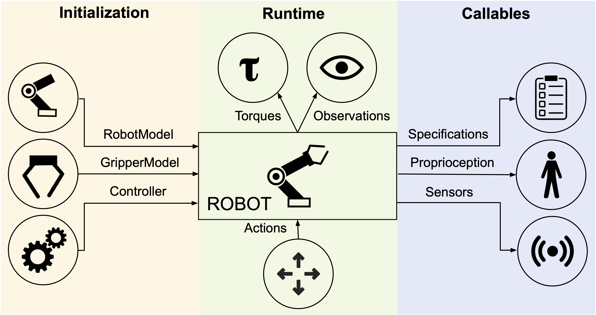

# Robots

**Robots** are a key component in robosuite, and serve as the embodiment of a given agent as well as the central interaction point within an environment and key interface to mujoco for the robot-related state and control. **robosuite** captures this level of abstraction with the [Robot](../simulation/robot)-based classes, with support for both single-armed and bimnaual variations. In turn, the Robot class is centrally defined by a [RobotModel](../modeling/robot_model), [GripperModel(s)](../modeling/gripper_model) (with no gripper being represented by a dummy class), and [Controller(s)](../simulation/controller).

The high-level features of **robosuite**'s robots are described as follows:

* **Diverse and Realistic Models**: **robosuite** provides models for 8 commercially-available robots (including the bimanual Baxter robot), 7 grippers (including the popular Robotiq 140 / 85 models), and 6 controllers, with model properties either taken directly from company website or raw spec sheets.

* **Modularized Support**: Robots are designed to be plug-n-play -- any combinations of robots, grippers, and controllers can be used, assuming the given environment is intended for the desired robot configuration. Because each robot is assigned a unique ID number, multiple instances of identical robots can be instantiated within the simulation without error.

* **Self-Enclosed Abstraction**: For a given task and environment, any information relevant to the specific robot instance can be found within the properties and methods within that instance. This means that each robot is responsible for directly setting its initial state within the simulation at the start of each episode, and also directly controls the robot in simulation via torques outputted by its controller's transformed actions.

Below, we discuss the usage and functionality of the robots over the course of its program lifetime.

#### Initialization
During environment creation (`suite.make(...)`), individual robots are both instantiated and initialized. A desired RobotModel, GripperModel(s), and Controller(s) (where multiple can be specified for bimanual robots) are loaded into each robot, with the models being passed into the environment to compose the final mujoco simulation object. Each robot is then set to its initial state.

#### Runtime
During a given simulation episode (each `env.step(...)` call), the environment will receive a set of actions and distribute them accordingly to each robot, according to their respective action spaces. Each robot then converts these actions into low-level torques via their respective controllers, and directly execute these torques in the simulation. At the conclusion of the environment step, each robot will pass its set of robot-specific observations to the environment, which will then concatenate and append additional task-level observations before passing them as output from the `env.step(...)` call.

#### Callables
At any given time, each robot has a set of `properties` whose real-time values can be accessed at any time. These include specifications for a given robot, such as its DOF, action dimension, and torque limits, as well as proprioceptive values, such as its joint positions and velocities. Additionally, if the robot is enabled with any sensors, those readings can also be polled as well.