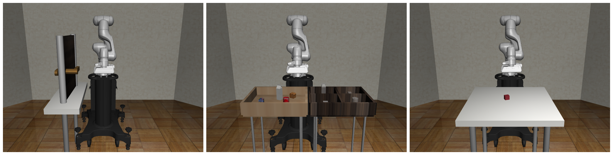
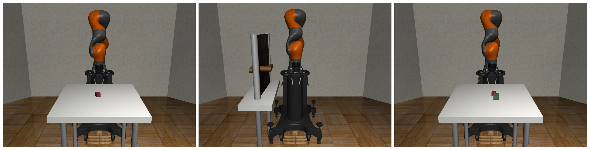
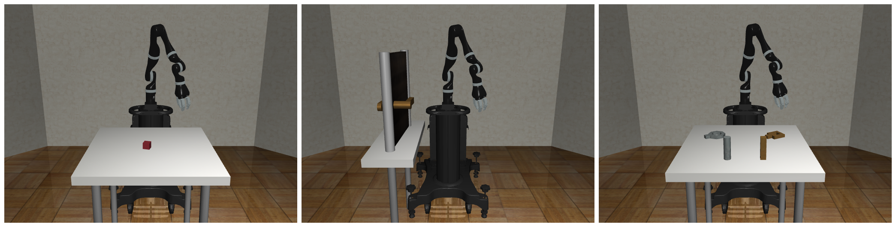
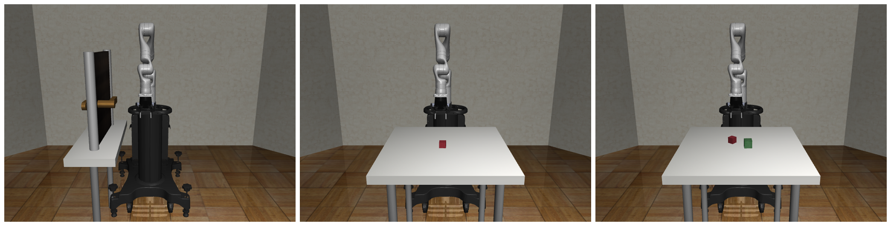
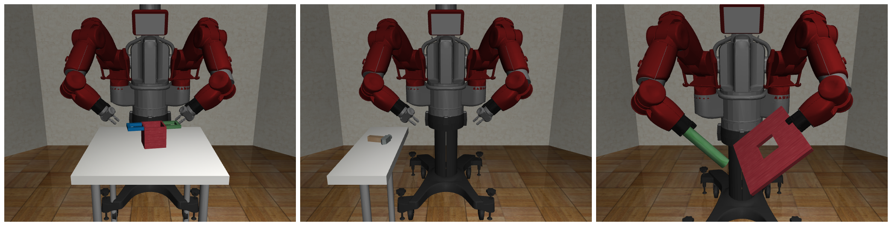

Robots
=======

.. figure:: ../images/robot_module.png

**Robots** are a key component in **robosuite**, and serve as the embodiment of a given agent as well as the central interaction point within an environment and key interface to MuJoCo for the robot-related state and control. **robosuite** captures this level of abstraction with the `Robot <../simulation/robot.html>`_-based classes, with support for both single-armed and bimanual variations. In turn, the Robot class is centrally defined by a `RobotModel <../modeling/robot_model.html>`_, `MountModel <../modeling/robot_model.html#mount-model>`_, and `Controller(s) <../simulation/controller.html>`_. Subclasses of the :class:`RobotModel` class may also include additional models as well; for example, the `ManipulatorModel <../modeling/robot_model.html#manipulator-model>`_ class also includes `GripperModel(s) <../modeling/robot_model.html#gripper-model>`_ (with no gripper being represented by a dummy class).

The high-level features of **robosuite**'s robots are described as follows:

* **Diverse and Realistic Models**: **robosuite** provides models for 8 commercially-available manipulator robots (including the bimanual Baxter robot), 7 grippers (including the popular Robotiq 140 / 85 models), and 6 controllers, with model properties either taken directly from the company website or raw spec sheets.

* **Modularized Support**: Robots are designed to be plug-n-play -- any combinations of robots, models, and controllers can be used, assuming the given environment is intended for the desired robot configuration. Because each robot is assigned a unique ID number, multiple instances of identical robots can be instantiated within the simulation without error.

* **Self-Enclosed Abstraction**: For a given task and environment, any information relevant to the specific robot instance can be found within the properties and methods within that instance. This means that each robot is responsible for directly setting its initial state within the simulation at the start of each episode, and also directly controls the robot in simulation via torques outputted by its controller's transformed actions.

Usage
======
Below, we discuss the usage and functionality of the robots over the course of its program lifetime.

Initialization
--------------
During environment creation (``suite.make(...)``), individual robots are both instantiated and initialized. The desired RobotModel, MountModel, and Controller(s) (where multiple and/or additional models may be specified, e.g. for manipulator bimanual robots) are loaded into each robot, with the models being passed into the environment to compose the final MuJoCo simulation object. Each robot is then set to its initial state.

Runtime
-------
During a given simulation episode (each ``env.step(...)`` call), the environment will receive a set of actions and distribute them accordingly to each robot, according to their respective action spaces. Each robot then converts these actions into low-level torques via their respective controllers, and directly executes these torques in the simulation. At the conclusion of the environment step, each robot will pass its set of robot-specific observations to the environment, which will then concatenate and append additional task-level observations before passing them as output from the ``env.step(...)`` call.

Callables
---------
At any given time, each robot has a set of ``properties`` whose real-time values can be accessed at any time. These include specifications for a given robot, such as its DoF, action dimension, and torque limits, as well as proprioceptive values, such as its joint positions and velocities. Additionally, if the robot is enabled with any sensors, those readings can also be polled as well. A full list of robot properties can be found in the `Robots API <../simulation/robot.html>`_ section.

Models
======
**robosuite** is designed to be generalizable to multiple robotic domains. The current release focuses on manipulator robots. For adding new robots, we provide a `rudimentary guide <https://docs.google.com/document/d/1bSUKkpjmbKqWyV5Oc7_4VL4FGKAQZx8aWm_nvlmTVmE/edit?usp=sharing>`_ on how to import raw Robot and Gripper models (based on a URDF source file) into robosuite.

Manipulators
------------
**robosuite** currently supports seven commercially-available manipulator robot models. We briefly describe each individual model along with its features below:

Panda
~~~~~

- DoF: 7
- Parallel jaw gripper
- Fixed base

Sawyer
~~~~~~
.. image:: ../images/models/robot_model_Sawyer.png
   :alt: sawyer_robot
   :align: left
   :width: 50%

- DoF: 7
- Parallel jaw gripper
- Fixed base

LBR IIWA 7
~~~~~~~~~~

- DoF: 7
- ...
- ...

Jaco
~~~~

- DoF: 7
- ...
- ...

Kinova Gen3
~~~~~~~~~~~

- DoF: 7
- Parallel jaw gripper
- Fixed base

UR5e
~~~~
.. image:: ../images/models/robot_model_UR5e.png
   :alt: ur5e_robot
   :align: left
   :width: 50%

- DoF: 6
- Parallel jaw gripper
- Fixed base

Baxter
~~~~~~

- DoF: 14
- ...
- ...

Tiago
~~~~~~
.. image:: ...
   :alt: tiago_robot
   :align: left
   :width: 50%

- DoF: ...
- ...
- ...

GR1
~~~~~~
.. image:: ...
   :alt: gr1_robot
   :align: left
   :width: 50%

- DoF: ...
- ...
- ...

Create Your Own Robot
----------------------

<link_to_menagerine>

.. code-block:: python

  @register_robot_class("LeggedRobot")
  class GR1SchunkSVH(GR1):
      """
      Variant of GR1 robot with SchunkSVH hands.
      """

      @property
      def default_gripper(self):
          """
          Since this is bimanual robot, returns dict with `'right'`, `'left'` keywords corresponding to their respective
          values

          Returns:
              dict: Dictionary containing arm-specific gripper names
          """
          return {"right": "SchunkSvhRightHand", "left": "SchunkSvhLeftHand"}
