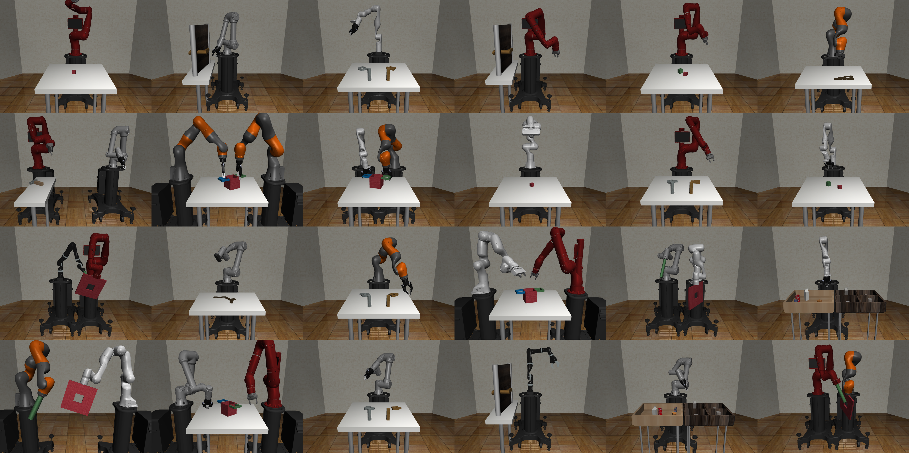

# Overview



**robosuite** is a simulation framework powered by the [MuJoCo](http://mujoco.org/) physics engine for robot learning. It also offers a suite of benchmark environments for reproducible research. The current release (v1.3) features rendering tools, ground-truth of vision modalities, and camera utilities. This project is part of the broader [Advancing Robot Intelligence through Simulated Environments (ARISE) Initiative](https://github.com/ARISE-Initiative), with the aim of lowering the barriers of entry for cutting-edge research at the intersection of AI and Robotics.

Data-driven algorithms, such as reinforcement learning and imitation learning, provide a powerful and generic tool in robotics. These learning paradigms, fueled by new advances in deep learning, have achieved some exciting successes in a variety of robot control problems. However, the challenges of reproducibility and the limited accessibility of robot hardware (especially during a pandemic) have impaired research progress. The overarching goal of **robosuite** is to provide researchers with:

* a standardized set of benchmarking tasks for rigorus evaluation and algorithm development;
* a modular design that offers great flexibility to design new robot simulation environments;
* a high-quality implementation of robot controllers and off-the-shelf learning algorithms to lower the barriers to entry.

This framework was originally developed since late 2017 by researchers in [Stanford Vision and Learning Lab](http://svl.stanford.edu) (SVL) as an internal tool for robot learning research. Now it is actively maintained and used for robotics research projects in SVL and the [UT Robot Perception and Learning Lab](http://rpl.cs.utexas.edu) (RPL). We welcome community contributions to this project. For details please check out our [contributing guidelines](CONTRIBUTING.md).

This release of **robosuite** contains seven robot models, eight gripper models, six controller modes, and nine standardized tasks. It also offers a modular design of APIs for building new environments with procedural generation. We highlight these primary features below:

* [**standardized tasks**](modules/environments): a set of standardized manipulation tasks of large diversity and varying complexity and RL benchmarking results for reproducible research;
* [**procedural generation**](modules/overview): modular APIs for programmatically creating new environments and new tasks as combinations of robot models, arenas, and parameterized 3D objects;
* [**controller supports**](modules/controllers): a selection of controller types to command the robots, such as joint-space velocity control, inverse kinematics control, operational space control, and 3D motion devices for teleoperation;
* [**multi-modal sensors**](modules/sensors): heterogeneous types of sensory signals, including low-level physical states, RGB cameras, depth maps, and proprioception;
* [**human demonstrations**](algorithms/demonstrations): utilities for collecting human demonstrations, replaying demonstration datasets, and leveraging demonstration data for learning.
* [**photorealistic rendering**](modules/renderers): integration with advanced graphics tools that provide real-time photorealistic renderings of simulated scenes.

## Citations
Please cite [robosuite](https://robosuite.ai) if you use this framework in your publications:
```
@inproceedings{robosuite2020,
  title={robosuite: A Modular Simulation Framework and Benchmark for Robot Learning},
  author={Yuke Zhu and Josiah Wong and Ajay Mandlekar and Roberto Mart\'{i}n-Mart\'{i}n},
  booktitle={arXiv preprint arXiv:2009.12293},
  year={2020}
}
```
