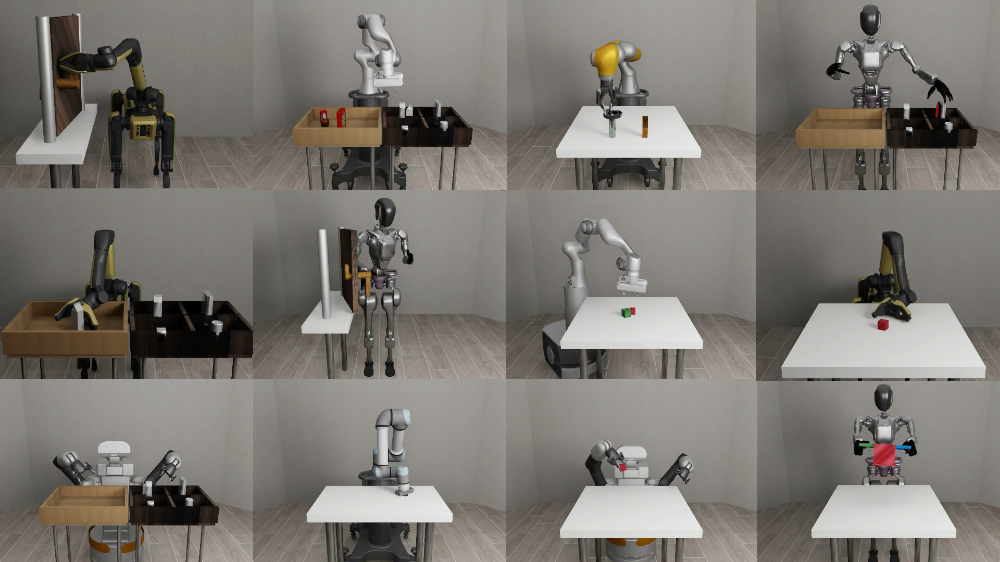

# Overview




**robosuite** is a simulation framework powered by the [MuJoCo](http://mujoco.org/) physics engine for robot learning. It also offers a suite of benchmark environments for reproducible research. The current release (v1.5) features support for diverse robot embodiments (including humanoids), custom robot composition, composite controllers (including whole body controllers), more teleoperation devices, photo-realistic rendering. This project is part of the broader [Advancing Robot Intelligence through Simulated Environments (ARISE) Initiative](https://github.com/ARISE-Initiative), with the aim of lowering the barriers of entry for cutting-edge research at the intersection of AI and Robotics.

Data-driven algorithms, such as reinforcement learning and imitation learning, provide a powerful and generic tool in robotics. These learning paradigms, fueled by new advances in deep learning, have achieved some exciting successes in a variety of robot control problems. However, the challenges of reproducibility and the limited accessibility of robot hardware have impaired research progress. The overarching goal of **robosuite** is to provide researchers with:

* a standardized set of benchmarking tasks for rigorous evaluation and algorithm development;
* a modular design that offers great flexibility in designing new robot simulation environments;
* a high-quality implementation of robot controllers and off-the-shelf learning algorithms to lower the barriers to entry.

This framework was originally developed in late 2017 by researchers in [Stanford Vision and Learning Lab](http://svl.stanford.edu) (SVL) as an internal tool for robot learning research. Now, it is actively maintained and used for robotics research projects in SVL, the [UT Robot Perception and Learning Lab](http://rpl.cs.utexas.edu) (RPL) and NVIDIA [Generalist Embodied Agent Research Group](https://research.nvidia.com/labs/gear/) (GEAR). We welcome community contributions to this project. For details, please check out our [contributing guidelines](CONTRIBUTING.md).

**Robosuite** offers a modular design of APIs for building new environments, robot embodiments, and robot controllers with procedural generation. We highlight these primary features below:

* **standardized tasks**: a set of standardized manipulation tasks of large diversity and varying complexity and RL benchmarking results for reproducible research;
* **procedural generation**: modular APIs for programmatically creating new environments and new tasks as combinations of robot models, arenas, and parameterized 3D objects. Check out our repo [robosuite_models](https://github.com/ARISE-Initiative/robosuite_models) for extra robot models tailored to robosuite.
* **robot controllers**: a selection of controller types to command the robots, such as joint-space velocity control, inverse kinematics control, operational space control, and whole body control;
* **teleoperation devices**: a selection of teleoperation devices including keyboard, spacemouse, dualsense and MuJoCo viewer drag-drop;
* **multi-modal sensors**: heterogeneous types of sensory signals, including low-level physical states, RGB cameras, depth maps, and proprioception;
* **human demonstrations**: utilities for collecting human demonstrations, replaying demonstration datasets, and leveraging demonstration data for learning. Check out our sister project [robomimic](https://arise-initiative.github.io/robomimic-web/);
* **photorealistic rendering**: integration with advanced graphics tools that provide real-time photorealistic renderings of simulated scenes, including support for NVIDIA Isaac Sim rendering.

## Citation
Please cite [**robosuite**](https://robosuite.ai) if you use this framework in your publications:
```bibtex
@inproceedings{robosuite2020,
  title={robosuite: A Modular Simulation Framework and Benchmark for Robot Learning},
  author={Yuke Zhu and Josiah Wong and Ajay Mandlekar and Roberto Mart\'{i}n-Mart\'{i}n and Abhishek Joshi and Kevin Lin and Abhiram Maddukuri and Soroush Nasiriany and Yifeng Zhu},
  booktitle={arXiv preprint arXiv:2009.12293},
  year={2020}
}
```
